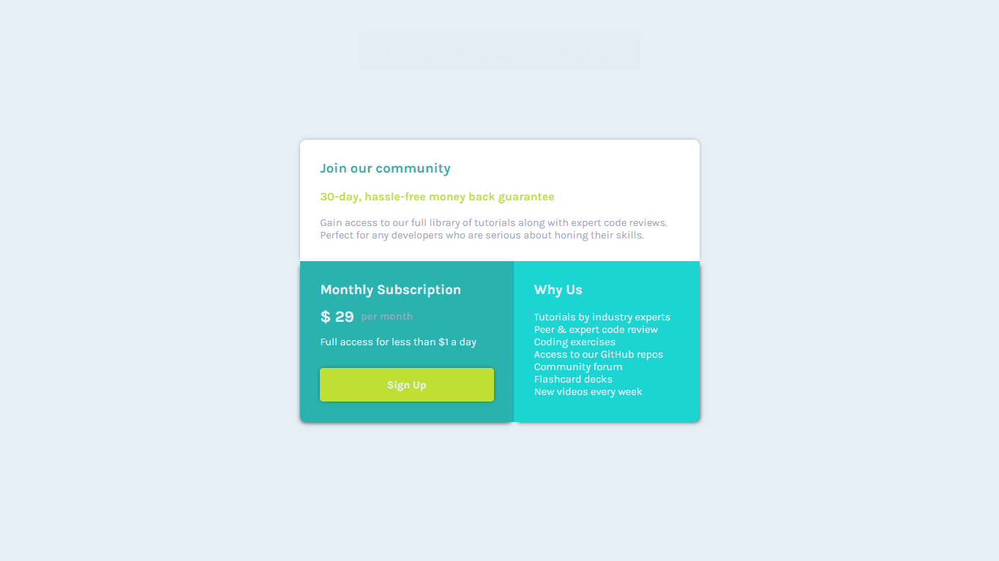

# Desafio Componente Preço Único - Frontend-Mentor

Este é um desafio de um Componente de Preço Único proposto pelo site Frontend-Mentor.

## Tabela de Conteúdos

- [Visão Geral](#visão-geral)
    - [Imagens](#imagens)
    - [Link da página](#link)
- [Processo](#processo)
    - [Linguagens utilizadas](#linguagens-utilizadas)
    - [O que aprendi](#o-que-aprendi)
    - [Possíveis evoluções](#possíveis-evoluções)
- [Autor](#autor)

## Visão-geral

### Imagens

<br>

````
Versão de Desktop
````

   

<br>

````
Versão Mobile
````

 

### Link

- Página no GitHub Pages: <a href="https://julio-mansan2.github.io/single-price-card-component/">Clique aqui!</a>

## Processo

### Linguagens utilizadas

<br>

- Marcações semânticas de HTML5
- Propriedades de customização do CSS3

<br>

### O que aprendi

<br>

- Posicionar melhor os containers utilizando grid-template-areas:

````css

main {
    grid-template-areas:
    "introduction introduction"
    "sign benefits";
}

````

<br>

- Aplicar sombras em elementos

````css

section {
    box-shadow: -2px 4px 7px -3px rgba(0,0,0,0. 75);
}

````

<br>

### Possíveis evoluções

<br>

- Códigos mais compactos;
- Padronizar medidas;
- Centralizar elementos de forma mais prática.

<br>

## Autor

GitHub - <a href="https://github.com/julio-mansan2">julio-mansan2</a> <br>
Front-end Mentor - <a href="https://www.frontendmentor.io/profile/julio-mansan2">julio-mansan2</a> <br>